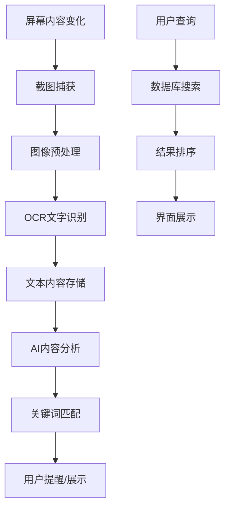
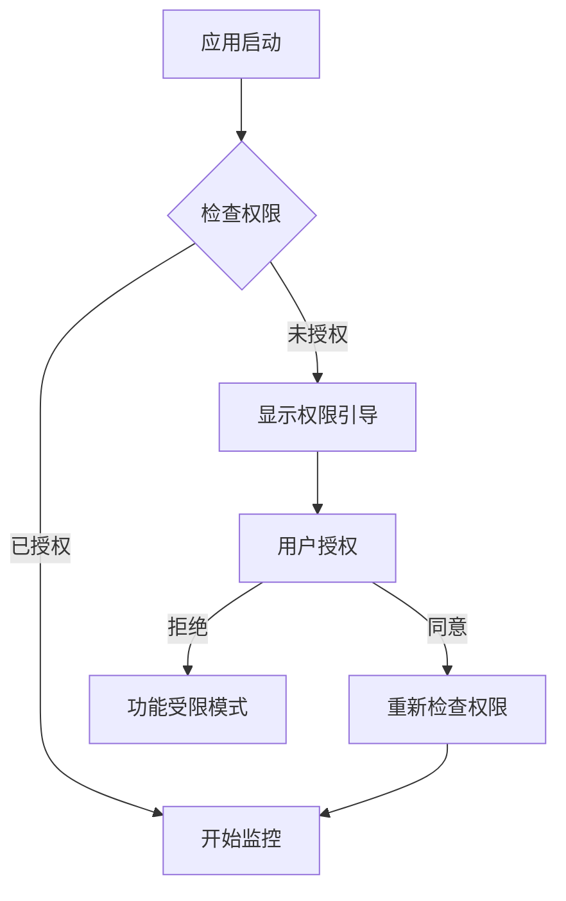
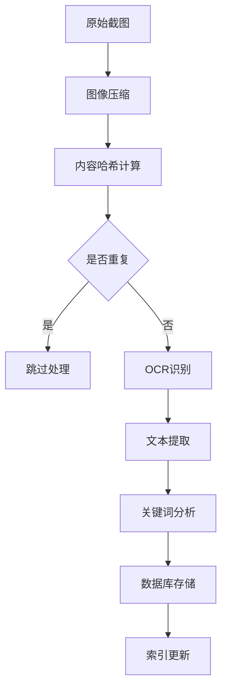

# ScreenWatcher 产品需求文档 (Product Requirements Document)

## 1. 产品概述

### 1.1 产品定义
**产品名称**: ScreenWatcher  
**产品类型**: 桌面端屏幕监听与智能分析工具  
**核心定位**: 透明化监听屏幕内容，通过本地OCR和AI技术为用户提供智能工作辅助  

### 1.2 产品愿景
成为知识工作者的智能桌面助手，通过透明监听和智能分析，提升工作效率和信息处理能力。

### 1.3 核心价值主张
- **透明监听**: 无感知监听屏幕内容变化
- **本地处理**: 所有数据本地存储，保护隐私安全
- **智能分析**: AI驱动的内容理解和工作流优化
- **跨应用整合**: 统一管理来自不同应用的信息

## 2. 市场分析

### 2.1 市场背景
随着远程工作和数字化办公的普及，知识工作者面临：
- 信息过载，难以有效管理屏幕上的大量信息
- 频繁在多个应用间切换，效率低下
- 重要信息容易遗漏，缺乏统一的信息管理工具

### 2.2 目标市场规模
- **全球知识工作者**: 约12亿人
- **远程工作市场**: 预计2025年达到500亿美元
- **生产力工具市场**: 年复合增长率13.4%

### 2.3 竞品分析

| 竞品 | 定位 | 优势 | 劣势 | 差异化策略 |
|:---:|:---:|:---:|:---:|:---:|
| RescueTime | 时间追踪 | 成熟稳定 | 功能单一，无OCR | 实时内容分析 |
| ManicTime | 活动监控 | 详细统计 | 界面复杂 | 简洁透明设计 |
| Toggl Track | 项目时间 | 团队协作 | 需手动操作 | 自动化监听 |
| CleanMyMac | 系统优化 | 品牌知名度 | 非专业工具 | 专注内容分析 |

### 2.4 市场机会
- **技术成熟**: OCR和AI技术日趋成熟，成本下降
- **隐私关注**: 用户对数据隐私的重视为本地处理方案创造机会
- **效率需求**: 后疫情时代对生产力工具需求激增
- **平台集中**: macOS用户付费能力强，接受度高

## 3. 用户分析

### 3.1 目标用户画像

| 用户类型 | 用户特征 | 核心需求 | 使用场景 | 付费意愿 | 技术水平 |
|:-------:|:-------:|:-------:|:-------:|:-------:|:-------:|
| **知识工作者** | 白领、咨询师、分析师 | 信息整理、效率提升 | 日常办公、数据分析 | 高 | 中等 |
| **研究人员** | 学者、研发人员 | 文献管理、资料收集 | 学术研究、论文写作 | 中等 | 高 |
| **内容创作者** | 博主、作家、设计师 | 灵感收集、素材管理 | 内容创作、素材收集 | 中等 | 中等 |
| **远程工作者** | 自由职业者、远程员工 | 工作追踪、时间管理 | 居家办公、客户汇报 | 中等 | 中等 |

### 3.2 用户痛点分析
- **信息过载**: 屏幕上信息量大，难以有效过滤和管理
- **工作流断裂**: 频繁切换应用，上下文丢失
- **重要信息遗漏**: 关键信息容易被忽略或遗忘
- **效率评估困难**: 难以量化工作效率和时间分配
- **隐私担忧**: 担心敏感信息被上传到云端

### 3.3 用户使用场景

#### 场景1: 研究人员文献调研
**用户**: 博士研究生小李  
**场景**: 在线阅读学术论文，需要收集和整理关键信息  
**痛点**: 重要概念和数据容易遗漏，难以建立知识关联  
**解决方案**: 自动识别学术关键词，建立知识图谱

#### 场景2: 咨询顾问数据分析
**用户**: 管理咨询师王总  
**场景**: 分析客户数据，准备咨询报告  
**痛点**: 多个数据源切换，关键洞察容易遗漏  
**解决方案**: 跨应用数据关联，智能提取关键信息

#### 场景3: 内容创作者素材收集
**用户**: 科技博主张三  
**场景**: 浏览技术资讯，收集写作素材  
**痛点**: 好的素材点子稍纵即逝，难以系统管理  
**解决方案**: 智能标记有价值内容，按主题自动分类

## 4. 功能需求

### 4.1 MVP功能 (P0 - 必须实现)

#### 功能1: 屏幕内容监听
**用户故事**: 作为知识工作者，我希望应用能自动监听屏幕内容变化，以便捕获重要信息  
**功能描述**: 
- 实时监控活动窗口内容变化
- 支持全屏监控和窗口级监控两种模式
- 智能识别内容变化，避免重复捕获

**验收标准**:
- [ ] 能够检测到窗口内容变化（滚动、页面切换等）
- [ ] 变化检测延迟 < 500ms
- [ ] 支持主流应用（浏览器、文档、代码编辑器等）
- [ ] 提供监控开关，用户可随时启停

**技术要求**:
- 使用macOS Screen Capture API
- 实现高效的图像差分算法
- 内存占用 < 100MB

#### 功能2: OCR文字识别
**用户故事**: 作为用户，我希望应用能准确识别屏幕上的文字内容，以便后续分析处理  
**功能描述**:
- 对捕获的屏幕内容进行OCR识别
- 支持中英文混合识别
- 保留文字的位置和格式信息

**验收标准**:
- [ ] 中文识别准确率 > 95%
- [ ] 英文识别准确率 > 98%
- [ ] 识别延迟 < 2秒
- [ ] 支持常见字体和字号

**技术要求**:
- 集成Apple Vision框架或Tesseract
- 实现文字区域检测和分割
- 支持多语言识别

#### 功能3: 本地数据存储
**用户故事**: 作为关注隐私的用户，我希望所有数据都存储在本地，确保敏感信息不泄露  
**功能描述**:
- 使用SQLite数据库存储识别结果
- 实现数据的增删改查功能
- 支持数据备份和恢复

**验收标准**:
- [ ] 数据完全本地存储，不上传云端
- [ ] 支持至少10万条记录
- [ ] 数据检索速度 < 100ms
- [ ] 提供数据导出功能

**技术要求**:
- SQLite数据库设计
- 实现数据索引和全文搜索
- 支持数据压缩和清理

#### 功能4: 基础控制面板
**用户故事**: 作为用户，我需要一个简洁的界面来控制应用的运行状态和查看基本统计  
**功能描述**:
- 提供开始/暂停监控的控制按钮
- 显示当前监控状态和基本统计
- 提供设置和偏好配置入口

**验收标准**:
- [ ] 界面响应时间 < 200ms
- [ ] 支持快捷键操作
- [ ] 状态显示实时更新
- [ ] 提供系统托盘图标

**技术要求**:
- Electron + React技术栈
- 实现系统托盘功能
- 响应式界面设计

#### 功能5: 权限管理
**用户故事**: 作为macOS用户，我希望应用能正确请求和管理系统权限，确保功能正常使用  
**功能描述**:
- 请求屏幕录制权限
- 请求辅助功能权限
- 提供权限状态检查和引导

**验收标准**:
- [ ] 首次启动时正确请求权限
- [ ] 提供权限缺失时的友好提示
- [ ] 支持权限状态实时检查
- [ ] 提供权限设置跳转链接

**技术要求**:
- 集成macOS权限API
- 实现权限状态检测
- 提供用户权限引导界面

### 4.2 增强功能 (P1 - 优先实现)

#### 功能6: 智能内容分析
**用户故事**: 作为知识工作者，我希望应用能智能分析屏幕内容，提取关键信息和洞察  
**功能描述**:
- 使用AI技术分析文本内容
- 提取关键词、实体和主题
- 识别重要信息和异常内容

**验收标准**:
- [ ] 关键词提取准确率 > 85%
- [ ] 支持10种以上主题分类
- [ ] 分析延迟 < 5秒
- [ ] 支持自定义分析规则

#### 功能7: 关键词提醒
**用户故事**: 作为用户，我希望当屏幕出现特定关键词时能收到提醒，避免错过重要信息  
**功能描述**:
- 支持用户自定义关键词列表
- 实时监控关键词出现
- 提供多种提醒方式（通知、声音、弹窗）

**验收标准**:
- [ ] 关键词检测延迟 < 1秒
- [ ] 支持正则表达式匹配
- [ ] 提供误报率控制
- [ ] 支持关键词优先级设置

#### 功能8: 数据可视化
**用户故事**: 作为用户，我希望能够可视化查看我的屏幕使用情况和内容分布  
**功能描述**:
- 提供时间线视图显示屏幕活动
- 生成应用使用统计图表
- 展示关键词云和主题分布

**验收标准**:
- [ ] 图表加载时间 < 2秒
- [ ] 支持多种时间维度（日/周/月）
- [ ] 提供数据筛选和排序
- [ ] 支持图表导出功能

### 4.3 未来功能 (P2 - 后续版本)

#### 功能9: 云端同步
**用户故事**: 作为多设备用户，我希望能在不同设备间同步我的数据和设置  
**功能描述**:
- 提供可选的云端同步功能
- 支持数据加密传输和存储
- 实现多设备间的数据一致性

#### 功能10: 团队协作
**用户故事**: 作为团队成员，我希望能够分享特定的屏幕内容分析结果给同事  
**功能描述**:
- 支持创建共享的内容集合
- 提供团队成员权限管理
- 实现协作标注和评论功能

## 5. 非功能性需求

### 5.1 性能需求
- **启动时间**: 应用冷启动时间 < 3秒
- **响应时间**: UI操作响应时间 < 200ms
- **资源占用**: 
  - 内存占用 < 150MB（正常运行）
  - CPU占用 < 5%（空闲状态）
  - 磁盘占用 < 50MB（应用本体）
- **处理能力**: 支持同时监控最多3个活动窗口

### 5.2 可用性需求
- **界面语言**: 支持中文和英文
- **学习成本**: 新用户5分钟内掌握基本操作
- **操作便捷**: 核心功能不超过3次点击到达
- **错误处理**: 提供友好的错误提示和恢复建议

### 5.3 可靠性需求
- **稳定性**: 连续运行24小时不崩溃
- **数据完整性**: 数据丢失率 < 0.1%
- **异常恢复**: 应用崩溃后能自动恢复监控状态
- **向下兼容**: 支持数据库版本升级和迁移

### 5.4 安全性需求
- **数据加密**: 敏感数据本地加密存储
- **权限控制**: 严格按需申请系统权限
- **隐私保护**: 默认不收集用户隐私数据
- **安全更新**: 支持自动安全更新机制

### 5.5 兼容性需求
- **操作系统**: macOS 10.15+（Intel + Apple Silicon）
- **应用兼容**: 支持主流应用（Safari、Chrome、VS Code等）
- **屏幕支持**: 支持多显示器和不同分辨率
- **输入法**: 支持各种中文输入法

## 6. 技术架构需求

### 6.1 整体架构
```
┌─────────────────────────────────────────┐
│            用户界面层 (UI Layer)           │
├─────────────────────────────────────────┤
│          业务逻辑层 (Business Layer)        │
├─────────────────────────────────────────┤
│          数据访问层 (Data Access Layer)     │
├─────────────────────────────────────────┤
│         系统集成层 (System Integration)     │
└─────────────────────────────────────────┘
```

### 6.2 技术栈选择
- **前端框架**: Electron + React + TypeScript
- **状态管理**: Redux Toolkit
- **UI组件**: Ant Design 或自定义组件系统
- **数据存储**: SQLite + TypeORM
- **OCR引擎**: Apple Vision Framework
- **AI分析**: TensorFlow.js 或 Core ML
- **构建工具**: Webpack + electron-builder

### 6.3 核心模块设计

#### 6.3.1 屏幕捕获模块
```typescript
interface ScreenCaptureService {
  startCapture(options: CaptureOptions): Promise<void>
  stopCapture(): Promise<void>
  onContentChange(callback: (image: ImageData) => void): void
  getCurrentWindows(): Promise<WindowInfo[]>
}
```

#### 6.3.2 OCR处理模块
```typescript
interface OCRService {
  recognizeText(image: ImageData): Promise<TextRecognitionResult>
  setLanguage(language: string[]): void
  getConfidence(): number
}

interface TextRecognitionResult {
  text: string
  boundingBoxes: BoundingBox[]
  confidence: number
  language: string
}
```

#### 6.3.3 数据存储模块
```typescript
interface DataService {
  saveScreenshot(data: ScreenshotData): Promise<string>
  saveTextContent(content: TextContent): Promise<string>
  searchContent(query: SearchQuery): Promise<SearchResult[]>
  getStatistics(timeRange: TimeRange): Promise<Statistics>
}
```

### 6.4 数据模型设计

#### 6.4.1 核心实体
```sql
-- 截图记录表
CREATE TABLE screenshots (
  id INTEGER PRIMARY KEY AUTOINCREMENT,
  timestamp DATETIME NOT NULL,
  window_title TEXT,
  app_name TEXT,
  image_path TEXT,
  content_hash TEXT,
  created_at DATETIME DEFAULT CURRENT_TIMESTAMP
);

-- 文本内容表
CREATE TABLE text_contents (
  id INTEGER PRIMARY KEY AUTOINCREMENT,
  screenshot_id INTEGER,
  content TEXT NOT NULL,
  bounding_box TEXT, -- JSON格式存储位置信息
  confidence REAL,
  language TEXT,
  created_at DATETIME DEFAULT CURRENT_TIMESTAMP,
  FOREIGN KEY (screenshot_id) REFERENCES screenshots(id)
);

-- 关键词表
CREATE TABLE keywords (
  id INTEGER PRIMARY KEY AUTOINCREMENT,
  word TEXT NOT NULL UNIQUE,
  priority INTEGER DEFAULT 1,
  color TEXT DEFAULT '#FF6B6B',
  is_active BOOLEAN DEFAULT 1,
  created_at DATETIME DEFAULT CURRENT_TIMESTAMP
);

-- 分析结果表
CREATE TABLE analysis_results (
  id INTEGER PRIMARY KEY AUTOINCREMENT,
  content_id INTEGER,
  analysis_type TEXT, -- 'keyword', 'topic', 'entity'
  result_data TEXT, -- JSON格式存储分析结果
  created_at DATETIME DEFAULT CURRENT_TIMESTAMP,
  FOREIGN KEY (content_id) REFERENCES text_contents(id)
);
```

## 7. 界面设计要求

### 7.1 设计原则
- **简洁性**: 界面简洁，突出核心功能
- **一致性**: 保持视觉和交互的一致性
- **可访问性**: 支持键盘导航和屏幕阅读器
- **原生感**: 遵循macOS设计规范和交互模式

### 7.2 主要界面规划

#### 7.2.1 主窗口布局
```
┌─────────────────────────────────────────┐
│  🎯 ScreenWatcher    [●] [■] [□] [×]     │
├─────────────────────────────────────────┤
│  [⏸️ 监控中] [⚙️ 设置] [📊 统计] [❓ 帮助]     │
├─────┬───────────────────────────────────┤
│ 📁  │  📝 今日捕获内容 (23条)              │
│ 应用 │  ┌─────────────────────────────┐  │
│ 列表 │  │ 14:32 - Chrome              │  │
│     │  │ 人工智能技术发展趋势...        │  │
│ 🌐   │  └─────────────────────────────┘  │
│ 浏览器│  ┌─────────────────────────────┐  │
│ 📝   │  │ 14:28 - VS Code             │  │
│ 代码  │  │ function analyzeScreen()... │  │
│ 📄   │  └─────────────────────────────┘  │
│ 文档  │                                │
│     │  🔍 搜索内容...                  │
└─────┴───────────────────────────────────┘
│     今日统计: 监控 4.5h | 文字 1.2万字    │
└─────────────────────────────────────────┘
```

#### 7.2.2 设置界面
```
┌─────────────────────────────────────────┐
│  ⚙️ 设置                               │
├─────────────────────────────────────────┤
│ 📱 常规设置                              │
│   □ 开机自动启动                         │
│   □ 最小化到系统托盘                     │
│   □ 自动检查更新                         │
│                                        │
│ 👁️ 监控设置                              │
│   监控模式: ○ 活动窗口 ○ 全屏 ○ 自定义   │
│   捕获间隔: [____] 秒 (默认: 2)         │
│   □ 排除特定应用                         │
│                                        │
│ 🔤 OCR设置                              │
│   识别语言: ☑️ 中文 ☑️ 英文              │
│   识别质量: ○ 快速 ● 平衡 ○ 高质量       │
│                                        │
│ 🗄️ 存储设置                              │
│   数据保留: [30] 天                     │
│   最大存储: [1] GB                      │
│   [清理旧数据] [备份数据] [导出数据]      │
└─────────────────────────────────────────┘
```

### 7.3 视觉设计要求
- **色彩方案**: 支持明亮/暗黑两种主题，跟随系统设置
- **字体**: San Francisco（系统默认字体）
- **图标风格**: 使用SF Symbols或一致的自定义图标
- **动画**: 适度使用过渡动画，提升用户体验
- **响应式**: 支持不同窗口尺寸的适配

## 8. 数据流程设计

### 8.1 核心数据流


### 8.2 权限申请流程


### 8.3 数据处理流程


## 9. 风险评估与缓解措施

### 9.1 技术风险

| 风险项 | 风险等级 | 影响程度 | 发生概率 | 缓解措施 |
|:-----:|:-------:|:-------:|:-------:|:-------:|
| OCR识别准确率低 | 高 | 高 | 中 | 多引擎对比测试，用户反馈优化 |
| 系统权限被拒 | 高 | 高 | 中 | 详细权限说明，降级使用方案 |
| 性能问题 | 中 | 中 | 中 | 性能监控，资源使用优化 |
| 兼容性问题 | 中 | 中 | 低 | 广泛测试，版本兼容策略 |
| 数据损坏 | 低 | 高 | 低 | 自动备份，数据校验机制 |

### 9.2 业务风险

| 风险项 | 风险等级 | 影响程度 | 发生概率 | 缓解措施 |
|:-----:|:-------:|:-------:|:-------:|:-------:|
| 隐私争议 | 高 | 高 | 中 | 透明的隐私政策，本地存储 |
| 用户接受度低 | 中 | 高 | 中 | 用户体验优化，价值传达 |
| 竞品威胁 | 中 | 中 | 高 | 差异化功能，快速迭代 |
| 法规变化 | 低 | 中 | 低 | 关注政策动态，合规设计 |

### 9.3 运营风险

| 风险项 | 风险等级 | 影响程度 | 发生概率 | 缓解措施 |
|:-----:|:-------:|:-------:|:-------:|:-------:|
| 开发进度延期 | 中 | 中 | 中 | 敏捷开发，里程碑控制 |
| 关键人员离职 | 中 | 高 | 低 | 知识文档化，团队备份 |
| 预算超支 | 低 | 中 | 低 | 成本控制，阶段评估 |

## 10. 项目里程碑与成功指标

### 10.1 开发里程碑

#### M1: 核心功能开发 (4周)
**目标**: 完成MVP核心功能开发
**可交付成果**:
- [ ] 屏幕监听功能
- [ ] OCR识别功能  
- [ ] 本地存储功能
- [ ] 基础UI界面
- [ ] 权限管理功能

**验收标准**:
- [ ] 所有P0功能正常工作
- [ ] 基础用户场景测试通过
- [ ] 代码覆盖率 > 80%

#### M2: 功能增强 (2周)
**目标**: 完成重要功能和用户体验优化
**可交付成果**:
- [ ] 智能内容分析
- [ ] 关键词提醒
- [ ] 数据可视化
- [ ] 界面优化

**验收标准**:
- [ ] 用户反馈评分 > 4.0/5.0
- [ ] 性能指标达到要求
- [ ] 主要bug修复完成

#### M3: 发布准备 (1周)
**目标**: 产品发布准备和质量保证
**可交付成果**:
- [ ] 安装程序制作
- [ ] 用户文档编写
- [ ] 测试用例覆盖
- [ ] 发布渠道准备

**验收标准**:
- [ ] 所有测试用例通过
- [ ] 安装和卸载正常
- [ ] 用户文档完整

### 10.2 成功指标

#### 10.2.1 产品指标
- **功能完整性**: MVP功能完成率 100%
- **质量指标**: 
  - Bug密度 < 1个/千行代码
  - 用户体验评分 > 4.0/5.0
  - OCR准确率 > 95%
- **性能指标**:
  - 应用启动时间 < 3秒
  - 内存占用 < 150MB
  - CPU占用 < 5%（空闲）

#### 10.2.2 用户指标
- **用户满意度**: NPS(净推荐值) > 50
- **用户留存率**: 
  - 7日留存率 > 70%
  - 30日留存率 > 40%
- **使用频率**: 日均使用时长 > 2小时
- **功能使用率**: 核心功能使用率 > 80%

#### 10.2.3 技术指标
- **稳定性**: 
  - 崩溃率 < 0.1%
  - 24小时连续运行成功率 > 99%
- **兼容性**: 支持macOS 10.15+所有版本
- **安全性**: 通过安全审计，零严重漏洞
- **可维护性**: 代码复杂度评级为B+以上

### 10.3 上线后监控指标
- **用户增长**: 月活跃用户增长率
- **功能使用**: 各功能模块使用热力图
- **性能监控**: 实时性能指标监控
- **用户反馈**: 用户评价和建议收集
- **市场反应**: 下载量、评分、媒体报道等

## 11. 附录

### 11.1 术语表
- **OCR**: 光学字符识别(Optical Character Recognition)
- **MVP**: 最小可行产品(Minimum Viable Product)
- **NPS**: 净推荐值(Net Promoter Score)
- **API**: 应用程序编程接口(Application Programming Interface)
- **UI/UX**: 用户界面/用户体验(User Interface/User Experience)

### 11.2 参考资料
- [Apple Human Interface Guidelines](https://developer.apple.com/design/human-interface-guidelines/)
- [Electron Documentation](https://www.electronjs.org/docs)
- [macOS Security and Privacy Guide](https://developer.apple.com/documentation/security)
- [SQLite Best Practices](https://sqlite.org/lang.html)

### 11.3 联系信息
- **产品负责人**: [姓名] <email@example.com>
- **技术负责人**: [姓名] <email@example.com>  
- **项目经理**: [姓名] <email@example.com>

---

**文档版本**: v1.0  
**创建日期**: 2025-01-08  
**最后更新**: 2025-01-08  
**下次评审**: 2025-01-15